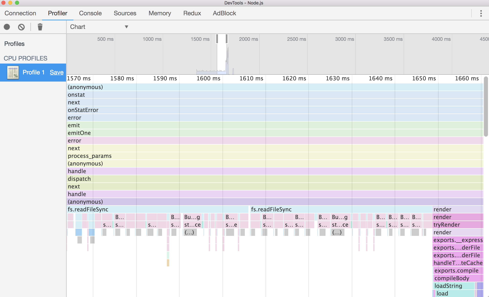

# Node Profiling

`node --inspect program`

Open the devtool and click the node icon. Use the `Profiler -> Chart` to analyze your code.

The talls are fine. The wides are what you should start looking at.
