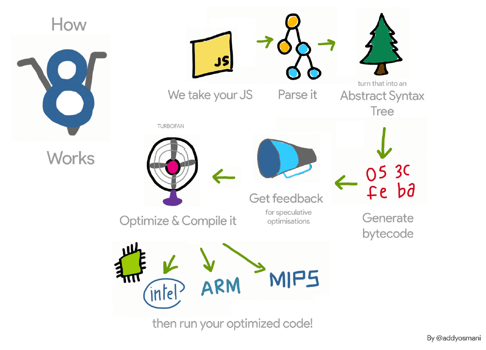

# Profiling

* Parse JS: Even you can compress the code to reduce its side, the engine still has to parse that **amount** of code.

* https://csstriggers.com/

* http://www.koalastothemax.com/

* `window.requestAnimationFrame`, `fastdom library`
  
  Avoid accessing DOM and store data in memory.

  Libraries such as React, Angular, make heavy use of requestAnimationFrame API under the hood.

Flame chart: tall blocks are fine, wide blocks are what you should start looking into.

