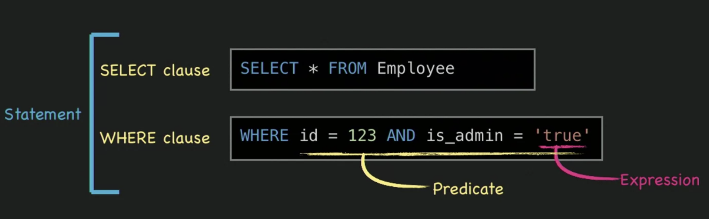

# Foundations of Relational Database

Mechanical sympathy.

## What is a Database

1. Organized collection of persisted data.
2. Write something and read it out later.

## Codd's Relational Model

- A `relation` is a set of `tuples` `(d1, d2, d3, d4)`
  - relation: table; tuples: rows.
- Each `element in a tuple` dj is a member of Dj, a `data domain`
  - element: cell value; data domain: set of allowed values.
- These elements are called `attribute values`, and are associated with an `attribute`.
  - attribute: column name + type

## Schema

The "shape" or structure of your data
  - database = shecma + data
Tables, column names, types and constrains.

### Structured Query Language (SQL)

- Used to manage data in a Relational Database Management System (RDBMS)
- Declarative, unlike its predecessors (imperative)
- Can be procedural too! (PL/SQL)
- Inspired by Codd's Relational Model.

Predicate is a condition.
Statement is a complete sentence.
Clause is a phrase.
Query is a kind of statement which is expected to come up with some results from database (SELECT).
